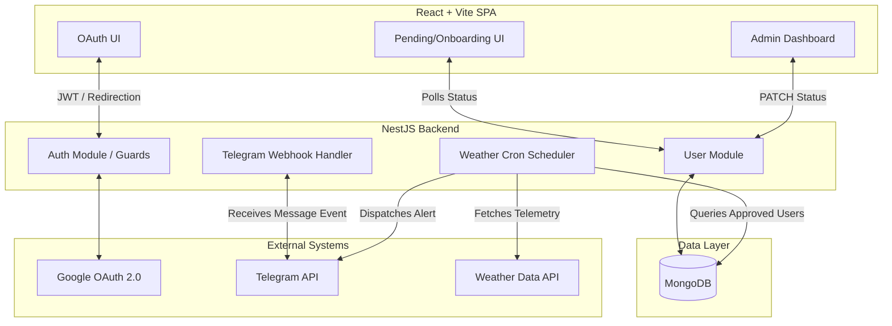

# WeatherGuard 🛡️

**Secure Weather Alert Management System**

WeatherGuard is an enterprise-grade weather alert dispatch platform built to demonstrate full-stack architectural proficiency, secure authentication workflows, and third-party webhook integrations. It provides a robust, multi-role approval workflow where end-users authenticate securely via Google OAuth, link their Telegram accounts via deep links, and await administrator approval before receiving automated weather alerts.

---

## 1. Project Overview
The goal of this project is to build a scalable, secure, and highly maintainable full-stack application. WeatherGuard solves the problem of verifying users before broadcasting potentially sensitive or API-heavy automated alerts. It emphasizes a strict separation of concerns, defensive programming, and a premium user experience.

## 2. Live Demo
- **Frontend URL:** `[Insert Production Vercel/Netlify Link]`
- **Backend URL:** `[Insert Production Render/Railway Link]`
- **Telegram Bot:** `[Insert Bot Username]`

---

## 3. System Architecture Diagram



---

## 4. Feature Breakdown
- **Zero-Friction Authentication**: Stateless JWT auth backed by Google OAuth.
- **Role-Based Access Control (RBAC)**: Strict separation between `USER` and `ADMIN` entities enforced via NestJS Guards.
- **Asynchronous Deep Linking**: Automated Telegram chat ID extraction via webhooks.
- **Reactive Polling UI**: Real-time onboarding checklist updates without manual refreshes.
- **Automated Job Dispatch**: NestJS task scheduling (`@nestjs/schedule`) for weather alert delivery.
- **Glassmorphic UI**: Production-ready, highly aesthetic frontend engineered with Tailwind CSS.

---

## 5. Database Schema

The core domain model is structured in MongoDB using Mongoose, keeping the schema flat and performant for the primary read paths.

```typescript
const UserSchema = new Schema({
  email: { type: String, unique: true, required: true },
  name: { type: String, required: true },
  googleId: { type: String, required: true },
  role: { type: String, enum: ['ADMIN', 'USER'], default: 'USER' },
  status: { type: String, enum: ['PENDING', 'APPROVED', 'REJECTED'], default: 'PENDING' },
  telegramChatId: { type: String, sparse: true },
  telegramLinkedAt: { type: Date }
}, { timestamps: true });
```

---

## 6. Approval Workflow
The system utilizes a 3-step cryptographically secure onboarding flow:
1. **Authentication**: User authenticates via Google OAuth. The backend provisions a record and issues a JWT.
2. **Identity Linking**: User requests a Telegram connection. The backend generates a unique connection payload and returns a deep link. When the user taps "Start" in Telegram, Telegram fires a webhook to the NestJS backend, which extracts the `chatId` and securely binds it to the user's record. 
3. **Admin Verification**: The user remains quarantined in a `PENDING` state. An administrator reviews the dashboard and issues a `PATCH` request to update the user to `APPROVED`. The user's frontend continuously polls the API to visually reflect these state transitions in real-time.

---

## 7. Weather Alert Workflow
A background service (`WeatherAlertService`) leverages cron (`*/30 * * * *`) to automate dispatch. 
When triggered, the service:
1. Executes a highly indexed query against MongoDB to fetch eligible users.
2. Interfaces with an external Weather API to grab current telemetry.
3. Formats a localized markdown payload.
4. Iterates through the user array, concurrently dispatching HTTP requests to the Telegram Bot API to deliver the messages.

## 8. Data Governance: How Only Approved Users Receive Alerts
Security and data integrity are enforced at the database query level, rather than in memory. The cron job explicitly queries:
```typescript
{ status: 'APPROVED', telegramChatId: { $exists: true, $ne: null } }
```
**Why this matters:** If an administrator revokes access (setting status to `REJECTED`), or if the user is still `PENDING`, they are completely excluded from the resulting dataset. This guarantees zero accidental dispatches and prevents API rate-limiting issues by ensuring we only process fully verified recipients.

---

## 9. Backend Architecture (NestJS)
The backend enforces strict modularity and Domain-Driven Design (DDD) principles:
- **Controllers**: Thin routing layers responsible solely for DTO validation and HTTP response mapping.
- **Services**: Pure business logic layers (e.g., `UsersService`, `TelegramLinkService`) utilizing Dependency Injection.
- **Guards**: `JwtAuthGuard` and `RolesGuard` intercept requests, verifying cryptographic signatures and RBAC claims before logic execution.

---

## 10. Frontend Architecture (React + Vite)
- **Routing**: Client-side routing via `react-router-dom` with protected route wrappers.
- **State Management**: React Hooks drive localized state.
- **Design System**: A cohesive, premium "startup aesthetic" utilizing Tailwind CSS. The UI features custom background blurs, deep shadows, and responsive grid layouts, stripping away heavy assets to prioritize layout and typography.

---

## 11. Technical Decisions and Tradeoffs
1. **Polling vs. WebSockets**: For the pending dashboard, short-polling every 5 seconds was chosen over establishing WebSockets. 
   - *Tradeoff*: While WebSockets provide marginally lower latency, polling vastly reduces server infrastructure complexity, eliminates connection-drop edge cases, and reduces memory footprint for an event (onboarding) that only happens once per user lifecycle.
2. **JWT vs Stateful Sessions**: JWTs allow the backend to remain completely stateless.
   - *Tradeoff*: We lose the ability to instantly revoke a specific session without a Redis blocklist, but we gain immense horizontal scalability and zero database lookups for standard API authorization.
3. **MongoDB**: Chosen for rapid iteration.
   - *Tradeoff*: Lacks strict relational constraints, but Mongoose schemas provide sufficient application-level strictness for the user entity without the rigid migration overhead of SQL.

---

## 12. Security Considerations
- **No API Keys in Source**: All secrets (JWT signatures, Telegram tokens, Mongo URIs, Google Client IDs) are strictly injected via environment variables.
- **Stateless Tokens**: JWTs mitigate CSRF risks when passed explicitly via Authorization headers rather than cookies.
- **Webhook Validation**: Webhook endpoints are obscure and trailing-slash strict to prevent arbitrary payload injection.
- **Sanitized Outputs**: Mongoose projections ensure that sensitive internal data is stripped before returning JSON payloads to the frontend.

---

## 13. Future Improvements
- **Message Queue Integration**: Migrate the cron job dispatch from in-memory `Promise.all` to a robust message queue (e.g., BullMQ / Redis) for guaranteed delivery, retry mechanisms, and horizontal worker scaling.
- **Rate Limiting**: Implement Redis-backed API rate limiting to prevent abuse of the deep-link generation endpoints.
- **Server-Sent Events (SSE)**: Transition the frontend polling mechanism to SSE for lighter-weight real-time UI updates.

---

## 14. Setup Instructions

### Prerequisites
- Node.js (v18+)
- MongoDB instance (local or Atlas)
- Telegram Bot Token (via BotFather)
- Google OAuth Credentials
- Ngrok (for local webhook testing)

### Backend Setup
```bash
cd api
npm install
cp .env.example .env # Populate with your keys
npm run start:dev
```

### Expose Webhook
```bash
ngrok http 3000
# Update Telegram bot webhook to your ngrok URL
```

### Frontend Setup
```bash
cd admin
npm install
cp .env.example .env # Point VITE_API_URL to localhost:3000
npm run dev
```